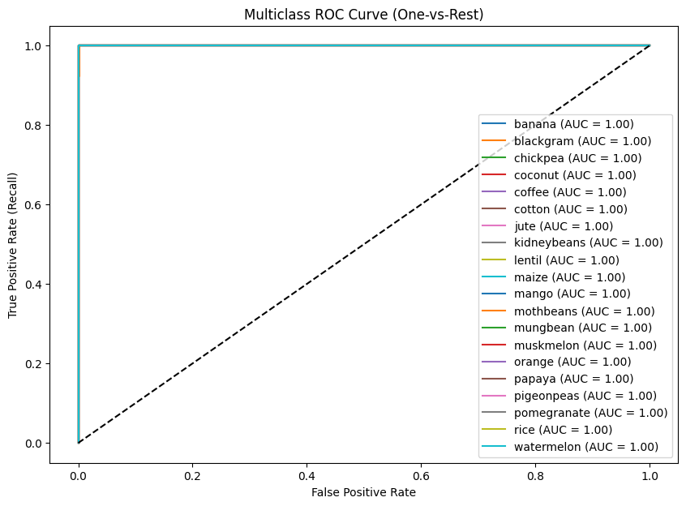
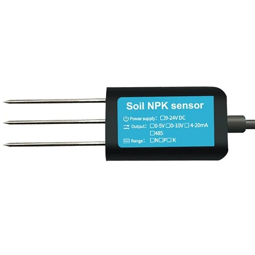
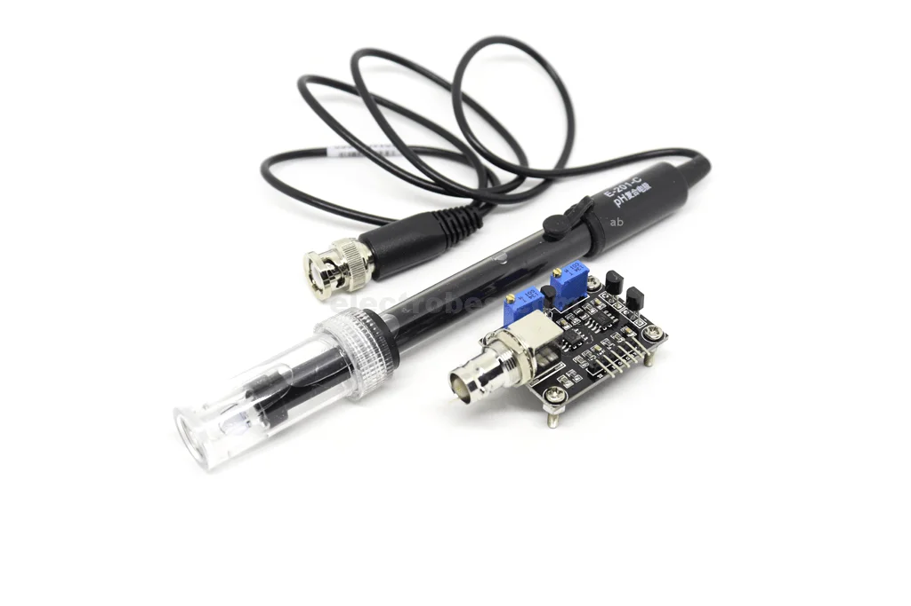
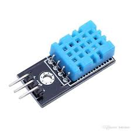

## **🌾 CropSense – Smart Crop Prediction**

CropSense is a machine learning-based crop prediction system designed to recommend the most suitable crop based on soil and environmental parameters. The system currently supports 22 crop classes and uses multiple machine learning models for prediction.

## **📊 Model Performance**
The model was trained using a dataset of soil and environmental parameters. The Random Forest Classifier gave the best results, but we also experimented with other models such as Logistic Regression and Multinomial Naive Bayes.

### **Random Forest Metrics**:
### **Accuracy: 0.9919**

### **F1 Score: 0.9907**

### **Precision: 0.9921**

### **Recall: 0.9903**

Other models like Logistic Regression and Multinomial Naive Bayes performed reasonably but with slightly lower accuracy. Random Forest is currently recommended for deployment.

The following **Multiclass ROC Curve (One-vs-Rest)** shows the performance of our Random Forest model across all 22 crop classes. Each class achieves an AUC of 1.00, indicating **perfect separability**:




## **🎯 Purpose**

The main purpose of CropSense is to:

Help farmers select the optimal crop based on soil nutrients and environmental factors.

Integrate with IoT sensors for real-time monitoring and recommendations.

Serve as a scalable platform for precision agriculture and data-driven farming.

Provide a user-friendly interface for farmers and researchers to make informed crop decisions.


## **🧰 Hardware & IoT Integration**

This system can be integrated with IoT devices to perform  **real-time crop recommendations**. The following sensors and devices are suggested:

## **1.NPK Sensor**
### **Purpose**:
Measures soil nutrients: Nitrogen (N), Phosphorus (P), Potassium (K)




## **2.Soil pH Sensor**
### **Purpose**:
Measures soil acidity or alkalinity





## **3.Temperature & Humidity Sensor**
### **Purpose**:
Measures ambient temperature and relative humidity





## **Hardware**:
Arduino Uno / ESP8266 / ESP32

Relay module (if automated irrigation or actuators are required)

Power supply (5V DC)

## **🛠️ Project Files**

| File                | Description                                                               |
| ------------------- | ------------------------------------------------------------------------- |
| `crop_pred.ipynb`   | Jupyter notebook with data exploration, preprocessing, and model training |
| `crops_pred.joblib` | Serialized Random Forest model for inference                              |
| `scaler.joblib`     | StandardScaler used for preprocessing input features                      |
| `main.py`           | Script to load the model and predict crops from input data                |
| `requirements.txt`  | Required Python libraries to run the project                              |


## **⚙️ Installation**

### Clone this repository###:

```bash
# Clone the repository from GitHub
git clone https://github.com/MuhammadHamza123c/CropSense.git

# Navigate into the project folder
cd CropSense
````
## **Install dependencies**:
```bash
pip install -r requirements.txt

```


## **Run the main script**:
```

streamlit run main.py


```

## **💻 Usage**

Provide input parameters (e.g., N, P, K, pH, Temperature, Humidity, Rainfall).


The system predicts the most suitable crop class.


## **📈 Conclusion**

CropSense is a highly accurate, scalable, and IoT-ready crop recommendation system. With an accuracy of 99.19% using Random Forest, it can assist farmers in selecting optimal crops based on soil and environmental conditions.


